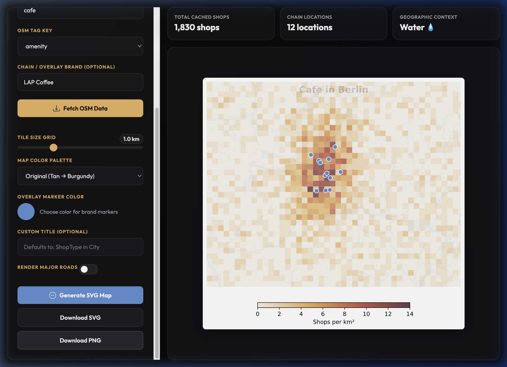

# ShopTiles – Choropleth Shop Density Maps

Generate beautiful editorial-style choropleth maps showing shop density in any city, with optional chain/brand location overlays. Built for data journalists, urban researchers, and designers.

🌐 **Live Demo:** [any-city-tiles.onrender.com](https://any-city-tiles.onrender.com/)



## Features

- 🗺️ **Choropleth tile maps** — square grid tiles colored by shop density (shops/km²) with **correct visual aspect ratio** (fixed Mercator distortion)
- 🌊 **Geographic underlay** — water features (rivers, lakes, canals) provide map context
- 🛣️ **Optional road overlay** — major roads (motorways, trunk, primary) for enhanced navigation reference
- 🔍 **Chain/brand overlays** — plot specific shop locations (e.g., LAP Coffee, Starbucks) as markers
- 🎨 **5 built-in color palettes** — Original (editorial style), Hot, Cool, Viridis, Grayscale
- 📊 **Flexible inputs** — any city, any shop type (cafes, pharmacies, bakeries, etc.), any chain
- 🎛️ **Customizable parameters** — tile size, palette, marker color, roads visibility, title
- 💾 **Local SQLite cache** — caches shop data, water features, and road vectors locally to prevent Overpass rate limiting and render maps in <1s
- 🌐 **Web UI + CLI** — use the browser interface or command-line scripts
- 📥 **Multiple exports** — SVG (vector, scalable) and PNG (raster)

## Quick Start

### 1. Install Dependencies

```bash
pip install -r requirements.txt
```

### 2. Initialize Database

```bash
python db.py
```

### 3. (Optional) Load Test Data

For development/demo without waiting for OSM API:

```bash
python test_data.py
```

This creates a Berlin dataset with ~1830 cafes and 12 LAP Coffee locations.

### 4. Start the Web Server

```bash
python server.py
```

Then open **http://localhost:5000** in your browser.

## Usage

### Web Interface

1. **Enter parameters** in the left sidebar:
   - City (e.g., "Berlin")
   - Shop type (e.g., "cafe", "boulangerie", "pharmacy")
   - OSM tag type (amenity or shop)
   - Chain/shop name (optional, e.g., "LAP Coffee")

2. **Click "Fetch Data"** to download shop locations from OpenStreetMap and cache them

3. **Adjust visual parameters:**
   - Tile size: 0.25–2.0 km (finer grid = more detail)
   - Color palette: Original, Hot, Cool, Viridis, Grayscale
   - Show major roads: toggle to include motorways, trunk, and primary roads (optional)
   - Marker color: pick any color for chain locations
   - Custom title (optional)

4. **Click "Generate Map"** to render the choropleth as SVG

5. **Download** as SVG (vector, scalable) or PNG (raster)

### Command Line

#### Fetch shop data and cache it

```bash
python fetch_data.py --city Berlin --shop-type cafe --tag amenity --chain "LAP Coffee"
```

**Arguments:**
- `--city` — city name (passed to Nominatim OSM lookup)
- `--shop-type` — OSM tag value (e.g., `cafe`, `restaurant`, `boulangerie`, `pharmacy`)
- `--tag` — OSM tag type: `amenity` or `shop`
- `--chain` — (optional) specific chain/shop name to overlay

#### Render a map to SVG

```bash
python render.py \
  --city Berlin \
  --shop-type cafe \
  --tag amenity \
  --chain "LAP Coffee" \
  --tile-size 1.0 \
  --palette original \
  --marker-color "#5b8fd4" \
  --show-roads \
  --title "Cafes in Berlin" \
  --output output.svg
```

**Key options:**
- `--show-roads` — include major roads on the map (adds geographic context)
- Remove this flag for a cleaner, density-focused map

Then open `output.svg` in a web browser or vector editor (Illustrator, Figma, Inkscape).

## Architecture

```
shopTiles/
├── db.py              # SQLite schema and query helpers
├── fetch_data.py      # CLI: fetch shops from OpenStreetMap via Overpass API
├── render.py          # CLI/API: generate choropleth SVG using matplotlib
├── server.py          # Flask web server with API endpoints
├── test_data.py       # Generate synthetic test dataset
├── shops.db           # SQLite database (auto-created)
├── requirements.txt   # Python dependencies
└── templates/
    └── index.html     # Web UI (HTML/CSS/JS)
```

### Data Flow

```
User Input (Web UI or CLI)
    ↓
Nominatim API ──→ Get city bounding box
    ↓
SQLite DB ──→ Check if shops & geo features are cached
    ↓ (Cache Miss)
Overpass API ──→ Query shops, water, roads within city bbox
    ↓
SQLite DB ──→ Cache shops & geo vectors (water, roads)
    ↓
Tile Grid ──→ Count shops per tile, compute density
    ↓
matplotlib (OO API) ──→ Project coordinates (Equirectangular) & render
    ↓
SVG Output ──→ Download or save to file
```

## Map Layers

Every rendered map includes:

1. **Background** — warm tan color (`#e8dcc8`) for map context
2. **Water features** — rivers, lakes, canals in light blue (`#c5dff8`)
   - Automatically fetched from OpenStreetMap
   - Helps viewers understand geographic boundaries
3. **Choropleth tiles** — colored by shop density using your chosen palette
   - 85% opacity to see water beneath
4. **Chain/shop markers** — circles showing specific locations (e.g., LAP Coffee)
   - White-bordered circles in your chosen marker color
   - Placed on top of tiles for visibility
5. **Major roads** (optional) — motorways, trunk, and primary roads in light gray (`#d0d0d0`)
   - Enable with `--show-roads` flag or "Show major roads" checkbox
   - Useful for navigation and geographic context
   - Adds ~7-10 MB to SVG size (significant detail)

## Data Sources

- **City boundaries & coordinates:** [Nominatim](https://nominatim.openstreetmap.org/) (OpenStreetMap)
- **Shop locations & water features & roads:** [Overpass API](https://overpass-api.de/) (OpenStreetMap)

All data is **free and open**, licensed under ODbL. No API key required.

### OSM Tags Reference

Common shop types:

| Type | Tag Type | Tag Value | Example |
|------|----------|-----------|---------|
| Coffee shop | amenity | cafe | `--tag amenity --shop-type cafe` |
| Restaurant | amenity | restaurant | `--tag amenity --shop-type restaurant` |
| Pharmacy | shop | pharmacy | `--tag shop --shop-type pharmacy` |
| Bakery | shop | bakery | `--tag shop --shop-type bakery` |
| Bar | amenity | bar | `--tag amenity --shop-type bar` |
| Hotel | tourism | hotel | `--tag tourism --shop-type hotel` |

See [OSM Wiki](https://wiki.openstreetmap.org/wiki/Key:amenity) for full list.

## API Endpoints

### `GET /`
Serve the web UI (index.html).

### `GET /api/cities`
List all cities in the local database.

**Response:**
```json
{ "cities": ["Berlin", "Paris"] }
```

### `GET /api/tags?city=Berlin`
List all fetched shop types for a city.

**Response:**
```json
{ "tags": ["amenity:cafe", "name:LAP Coffee"] }
```

### `GET /api/stats`
Retrieve statistics of cached data (shop counts, geo features count, fetch timestamp) for the front-end dashboard.

**Response:**
```json
{
  "Berlin": {
    "fetched_at": "2026-06-18 15:16:30.123456",
    "shops": {
      "amenity:cafe": 1830,
      "name:LAP Coffee": 12
    },
    "geo_features": {
      "water": 4339,
      "road": 892
    }
  }
}
```

### `POST /api/fetch`
Fetch shop data from OSM and cache in SQLite.

**Request body:**
```json
{
  "city": "Berlin",
  "shop_type": "cafe",
  "tag": "amenity",
  "chain": "LAP Coffee"
}
```

**Response:**
```json
{
  "status": "success",
  "background_count": 1830,
  "chain_count": 12,
  "message": "Fetched 1830 background shops and 12 LAP Coffee locations"
}
```

### `POST /api/render`
Render choropleth map and return SVG.

**Request body:**
```json
{
  "city": "Berlin",
  "shop_type": "cafe",
  "tag": "amenity",
  "chain": "LAP Coffee",
  "tile_size": 1.0,
  "palette": "original",
  "marker_color": "#5b8fd4",
  "show_roads": false,
  "title": "Cafes in Berlin"
}
```

**Response:**
```json
{
  "status": "success",
  "svg": "<svg xmlns='http://www.w3.org/2000/svg'>...</svg>"
}
```

**Parameters:**
- `show_roads` (boolean, default false) — include major roads as gray overlay for geographic context

## Color Palettes

| Name | Style | Use Case |
|------|-------|----------|
| **original** | Tan → Orange → Dark Purple | Editorial, high contrast |
| **hot** | Yellow → Orange → Red | Heatmap style |
| **cool** | Yellow → Green → Blue | Cold/fresh aesthetic |
| **viridis** | Purple → Green → Yellow | Colorblind-friendly |
| **grayscale** | White → Black | Print-friendly |

## Configuration

### Tile Size

Controls the resolution of the density grid:
- **0.25 km** — very fine detail, good for dense urban centers
- **0.5 km** — fine detail
- **1.0 km** — standard, good balance
- **2.0 km** — coarse overview

Larger tiles = smoother gradients but less detail.

### Marker Color

Any hex color (e.g., `#5b8fd4`, `#ff6b6b`). The UI includes a color picker.

### Custom Title

Optional. If not provided, defaults to "{ShopType} in {City}".

## Examples

### Example 1: Paris Bakeries

```bash
python fetch_data.py --city Paris --shop-type boulangerie --tag shop

python render.py \
  --city Paris \
  --shop-type boulangerie \
  --tag shop \
  --tile-size 0.5 \
  --palette cool \
  --title "Bakeries in Paris" \
  --output paris_bakeries.svg
```

### Example 2: Berlin Pharmacies (No Chain Overlay)

```bash
python fetch_data.py --city Berlin --shop-type pharmacy --tag shop

python render.py \
  --city Berlin \
  --shop-type pharmacy \
  --tag shop \
  --tile-size 1.5 \
  --palette viridis \
  --title "Pharmacies in Berlin" \
  --output berlin_pharmacies.svg
```

### Example 3: Web UI Flow

1. Open http://localhost:5000
2. Enter "Barcelona" in City field
3. Enter "bar" in Shop Type field
4. Set OSM Tag to "amenity"
5. Click "Fetch Data" → status shows count
6. Adjust Tile Size to 0.75 km
7. Change Palette to "hot"
8. Click "Generate Map"
9. Click "Download SVG"

## Deployment

This app is pre-configured for one-click deployment on **Render**.

### Automatic Blueprint Deployment

We have included a [render.yaml](file:///Users/la6387/workspace/shopTiles/render.yaml) specification in the repository root. To deploy:

1. Push this repository to your **GitHub** or **GitLab** account.
2. Log into the [Render Dashboard](https://render.com/).
3. Click **New +** and select **Blueprint**.
4. Connect this repository. Render will automatically parse `render.yaml` and provision your Flask web service.

### Manual Web Service Configuration

To configure the deployment manually in the Render dashboard:

1. Create a new **Web Service** and link your Git repository.
2. Select **Python** as the runtime.
3. Set the following parameters:
   - **Build Command:** `pip install -r requirements.txt`
   - **Start Command:** `gunicorn server:app`
4. Add the following **Environment Variable**:
   - `PYTHON_VERSION`: `3.11`

## Troubleshooting

### "City not found in DB"

The city hasn't been fetched yet. Click "Fetch Data" button or run:
```bash
python fetch_data.py --city YourCity --shop-type cafe --tag amenity
```

### "No shops found for [tag]:[shop_type]"

Either:
- The OSM tag/value combination doesn't exist in that city
- Try a different shop type (e.g., `restaurant` instead of `cafe`)
- Check [OSM Wiki](https://wiki.openstreetmap.org/wiki/Key:amenity) for valid tags

### Overpass API timeout

The public Overpass servers are rate-limited. Wait a few minutes and try again, or use the test data:
```bash
python test_data.py
```

### Matplotlib GUI error on macOS

Already fixed in this version (matplotlib backend set to "Agg" in render.py). If you see NSWindow errors, ensure your render.py has:
```python
import matplotlib
matplotlib.use("Agg")
```

### Large cities are slow

Fetching data for very large cities (>5M people) can take 5+ minutes. Be patient. Subsequent renders from the same city are instant.

## Performance

- **First fetch:** 1–10 minutes (depends on city size and OSM API load)
- **Subsequent renders:** <1 second (data is cached)
- **Database:** SQLite, typically 10–100 MB per city

## Customization

### Adjust Geographic Features

Edit the color and visibility of water, roads, and background in `render.py`:

```python
# Background color (current: warm tan)
ax.set_facecolor("#e8dcc8")

# Water color (current: light blue)
ax.fill(xs, ys, color="#c5dff8", edgecolor="#8ab4f8", linewidth=0.5, alpha=0.6)

# Road color (current: light gray)
ax.plot(xs, ys, color="#d0d0d0", linewidth=1.2, alpha=0.7)
```

### Add New Color Palette

Edit `render.py`:
```python
PALETTES = {
    "original": ...,
    "my_custom": LinearSegmentedColormap.from_list(
        "my_custom",
        ["#fff", "#f00", "#000"]  # white → red → black
    ),
}
```

Then use: `--palette my_custom`

### Change Default Tile Size

Edit the slider in `templates/index.html`:
```html
<input type="range" id="tileSize" min="0.25" max="2.0" step="0.25" value="1.0">
```
Change `value="1.0"` to your preferred default.

## Roadmap

- [x] ✅ Water features (rivers, lakes, canals) on map
- [x] ✅ Major roads overlay (optional)
- [ ] District/neighborhood labels on map
- [ ] Landmarks (points of interest) as context markers
- [ ] PNG export via server (faster than browser canvas)
- [ ] Caching of rendered maps
- [ ] Support for custom OSM queries (e.g., `amenity=cafe AND name~"independent"`)
- [ ] Multi-chain comparison overlays
- [ ] Heatmap export (continuous density instead of tiles)

## License

This project uses data from [OpenStreetMap](https://www.openstreetmap.org/), licensed under the ODbL.

The ShopTiles code is provided as-is for educational and journalistic use.

## Contributing

Found a bug or have a feature request? Please report it!

## Credits

Inspired by the European Correspondent's "Berlin's 1.50 coffee war" article (Dec 2025), which visualized LAP Coffee's expansion across Berlin using density choropleth mapping.

Built with:
- [Flask](https://flask.palletsprojects.com/) — web framework
- [matplotlib](https://matplotlib.org/) — charting and SVG rendering
- [OpenStreetMap](https://www.openstreetmap.org/) — open geospatial data
